## Helloooooooo! It's Bryaaan

# ⚽ Code x Football

### Building projects with the mindset of a football player

**Discipline • Teamwork • Strategy • Consistency**

### Tech stack lineup — 4-3-3 formation

---

## About Me

Hi, I’m a developer who is deeply passionate about **football** and technology.

I like building clean, useful, and practical web applications.  
For me, coding feels like football: you need good positioning, smart decisions, teamwork, and constant training.

---

## Football Mindset in Code

| Football       | Coding                            |
| -------------- | --------------------------------- |
| Strategy       | Planning project structure        |
| Teamwork       | Git, GitHub, collaboration        |
| Training       | Daily practice and learning       |
| Match analysis | Debugging and improving code      |
| Consistency    | Clean commits and stable progress |

---

## 🛠️ Tech Stack

---

## 🚀 Projects

### 🧑‍💼 Odoo-like Employee Management System

A web application inspired by Odoo ERP Employee module.

- Employee profile management
- Form-based data creation
- Database integration
- Clean UI structure
- Future-ready for HR module expansion

### 🤖 AI Quiz / Recipe Assistant

An AI-powered web application using modern web technologies.

- AI text generation
- Image analysis
- Text-to-image feature
- Authentication
- Database connection

### 🍔 Food Delivery Platform

A full-stack food ordering system.

- Product categories
- Cart system
- Admin order management
- MongoDB database
- Vercel deployment

---

## 📊 GitHub Stats

